# Crear un red virtual en VirtualBox

1 de Diciembre 2022

En esta práctica crearemos una red en Virtual Box para conectar en ella las máquinas con las que vamos a hacer las distintas prácticas.

## Crear la red ##

Para crear la red, lo primero que vamos a hacer es irnos a archivo, luego a herramientas y haremos clic en Network manager. Luego crearemos una Red NAT, para conectar las distintas máquinas virtuales:

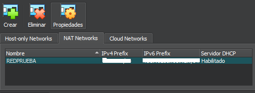

Configuraremos la red que se llamará REDPRUEBA, la IP de la red será la 192.168.56.1/24 y la máscara de red 255.255.255.0.

Además de esto habilitaremos el DHCP, para que reparta las IP:

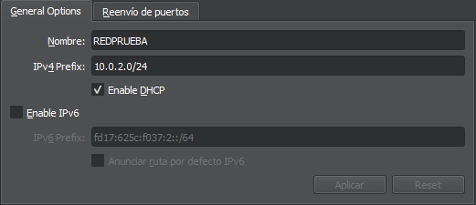

Una vez hecho esto tendremos que configurar cada máquina:

### Windows 10

Para configurar la máquina pulsaremos sobre ella y el botón configuración en el apartado de red estableceremos Red NAT y seleccionaremos nuestra red (REDPRUEBA)

Una vez configurada procederemos a iniciarla, una vez se ha iniciada abriremos una pantalla de comandos y observaremos si se ha hecho correctamente con el comando *ipconfig*:

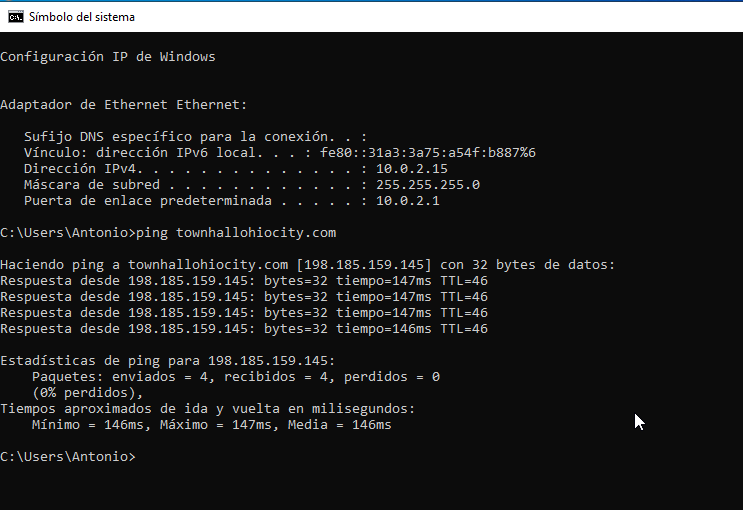

Como se puede observar en la imagen la red se ha configurado de manera correcta, esta en concreto tiene la dirección IP 10.0.2.15, la puerta de enlace es 10.0.2.1, después para comprobar que hay salida a internet usamos el comando *ping* y como se puede ver la conexión se realiza de forma satisfactoria.

### Windows Server 2019

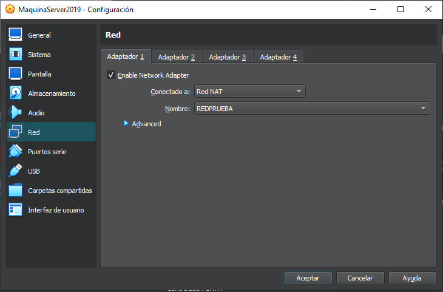

Para el Windows Server la instalación es igual a la de Windows 10.

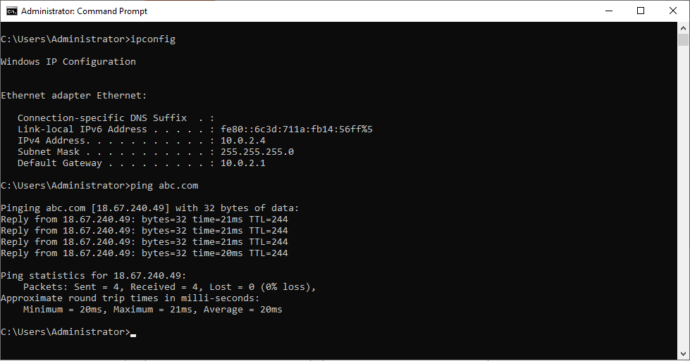

En esta ocasión vemos que el DHCP ha asignado a esta máquina la dirección 10.0.2.4, teniendo la misma máscara y puerta de enlace.

Antes de hacer ping las maquinas mutuamente, debemos activar unos ajustes en el Firewall de Windows para que se puedan conectar, seguiremos así estos pasos tanto en Windows Server 2019 como en Windows 10:

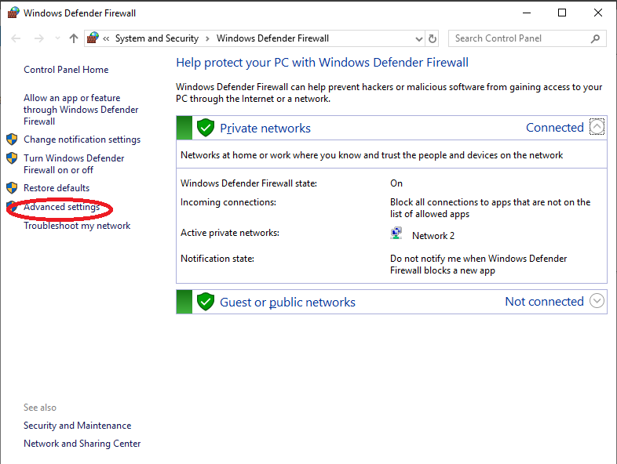

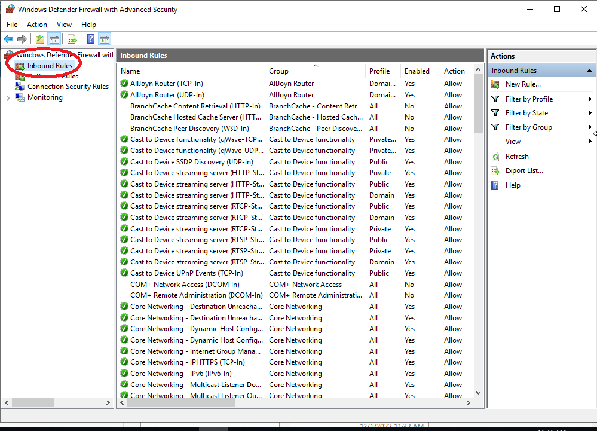

Luego de darle a Inbound Rules buscamos *File and printer Sharing (IPV4)*:

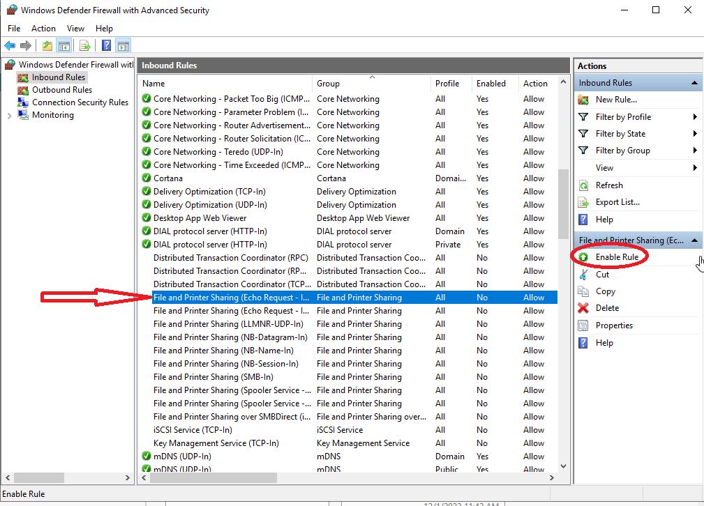

Y activamos, y así con Windows 10 también habilitamos la opción de compartir datos en impresoras y dispositivos.

### CentOS

La primera parte de la configuración es igual a las anteriores:

Ahora los siguientes pasos son totalmente diferentes a los anteriores procesos ya que CentOS usa un lenguaje algo distinto.

Para empezar usaremos el comando ip route para ver la información del adaptador de red:

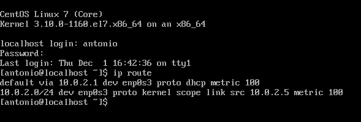

Podemos ver que el DHCP asigna a esta máquina la dirección 196.168.6.6, con la misma puerta de enlace que las anteriores.

Hacemos ping a la página de Google, obteniendo el siguiente resultado:

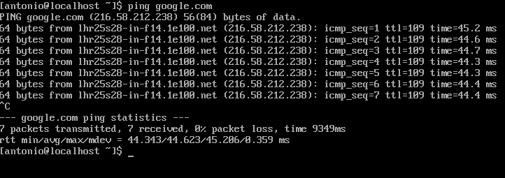

Tecleamos *ctrl + c* para parar el escaneo del ping. Como podemos ver esta máquina tiene salida a internet, probamos a intentar hacer ping a una de las otras máquina y viceversa.

Desde CentOS a Windows 10:

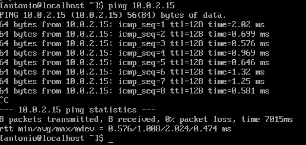

Y a Windows server 2019:

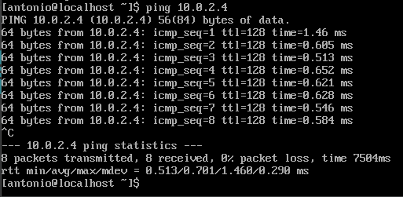

Podemos ver ya como nuestra red esta totalmente habilitada entre las 3 maquinas virtuales.

## Diagrama

